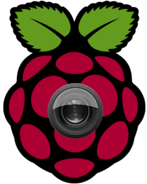

campi
=====

Another Raspberry Pi camera webserver.



What it does
============

Hosts a website where you can view your webcam in real time.

Why I wrote it
==============

There are a *lot* of tutorials out there on how to turn your pi into a webcam
server. Most of them involve installing [motion](http://www.lavrsen.dk/foswiki/bin/view/Motion),
which works great in many use cases. However, I wanted something simpler. Namely,
I wanted:

 * Minimal configuration
 * Password protection
 * One-way streaming
 * Easily customizable webpage
 * Extensible server

Campi does just this. Nothing else.

Installation
============

Campi uses Python, [tornado](http://www.tornadoweb.org/en/stable/) to create a
web server, and [opencv](http://opencv.org/) to interface with the webcam.
[Pillow](http://pillow.readthedocs.org/en/latest/installation.html) simplifies
image format conversion.

```
sudo apt-get install python-dev python-pip python-opencv
sudo pip install tornado Pillow
```

Once the dependencies are installed on your pi, you can clone this repository and
run the server.

```
git clone https://github.com/patrickfuller/campi.git
cd campi
python server.py
```

That's it. Navigate to http://your.r.pi.ip:8000 and check out your webcam.

####Password

The default password is "raspberry". In order to change it, run this in your
campi directory:

```
python -c "import hashlib; import getpass; print(hashlib.sha512(getpass.getpass())).hexdigest()" > password.txt
```

This will prompt you for a password, encrypt it, and save the result in
`password.txt`.

Note that this level of password protection is basic - it's fine for keeping the
occasional stranger out, but won't stand up to targeted hacking.

####Run on startup

It's nice to have your pi start campi whenever it turns on. Let's make that
happen.

```
sudo sh -c 'echo "#!/bin/sh
nohup python /home/pi/campi/server.py &" > /etc/init.d/campi'
sudo chmod +x /etc/init.d/campi
```

This creates the file `/etc/init.d/campi`, fills it with a command that runs
the server, and then sets it to executable. Note that you may need to change the
path (`/home/pi/campi/server.py`) to point to the right file.

####Customization

The website consists of `index.html`, `login.html`, and `style.css`. These can be
edited to change the look of campi.

If you want to add in extra functionality (like a slider for frame rate), edit
`client.js` and `server.py`. The client should send a request to the server, which
will then cause the server to do something.

If you want to add in extra camera features, opencv comes with a lot of useful
computer vision algorithms. Check out its functionality before writing your
own.
